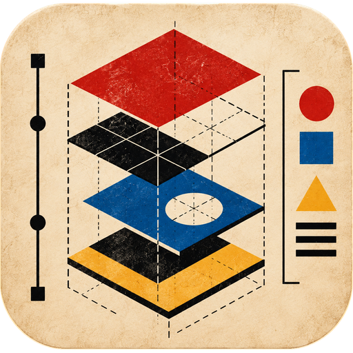

# Bauhaus



A design-system workshop for AI agents. Bauhaus helps Claude Code build, extract, audit, evolve and advise on a design system (DSM): its tokens, components, patterns, showcase and guide pages, and rulebook.

The name comes from the Bauhaus school (Weimar 1919, Dessau 1925, Berlin 1932–33). Its students took a preliminary course on form, colour and material first, then worked in the workshops. Bauhaus follows the same order: foundations first, then tokens, components and patterns. See `knowledge/bauhaus/principles.md`.

## What it gives you

- **Three layers, never mixed.** Foundation, component, pattern. Tokens are not a layer: they are the DTCG storage of foundation and component decisions. Every agent classifies an artifact before it builds or reviews it, and flags anything filed in the wrong layer (`knowledge/taxonomy/`).
- **States as a core concept.** Every component, pattern and screen has a state matrix: Speelman's nine lifecycle states and the interaction states (`knowledge/states/`).
- **One page contract.** Every slice has two pages. The showcase (`<name>.stories.tsx`, one `<DocPage/>` story) shows tokens, anatomy, the state matrix and a compact Do / Don't. The guide (`<name>.mdx`) holds the full introduction, usage, the reasoning per state, and pitfalls and don'ts with their reasons. Every rule names its basis: a WCAG criterion with its level, an APG pattern, a heuristic, a published system or a research result (`knowledge/governance/page-contract.md`).
- **Tech-agnostic tokens.** DTCG JSON is the source. Colour is stored as a palette (named hues), colors (role scales that alias it: the rebrand point) and roles per theme (`themes/light`, the default, and `themes/dark`, siblings that define the same role names). Components use roles only. `scripts/tokens.mjs` builds CSS, SCSS, JS, TS, JSON and a Tailwind preset.
- **Plain words first.** Advice comes in two registers: plain for anyone, then precise for the implementer (`knowledge/taxonomy/plain-language.md`).
- **A knowledge base** the agents read and cite (`knowledge/README.md`).

## Install

```bash
claude plugin marketplace add git@git.nexapptech.com:vbernier/bauhaus.git
claude plugin install bauhaus@bauhaus
```

## Skills

| Skill | Use it to |
|---|---|
| `/bauhaus:bauhaus` | Start here. See the project's status and pick a skill. |
| `/bauhaus:analyse` | Take an existing repo with no DSM to a full one in nine phases: foundations, tokens, components, patterns, a normalisation plan, then the build-up. |
| `/bauhaus:init` | Opt a project in: write `bauhaus.config.json` and seed tokens. |
| `/bauhaus:build` | Build a DSM from scratch, layer by layer. |
| `/bauhaus:extract` | Extract tokens from an existing codebase (phases 2–4 of analyse). |
| `/bauhaus:classify` | Sort artifacts into the three layers and flag misfiles. |
| `/bauhaus:advise` | Ask any design-system question. Get a plain answer, then a precise one. |
| `/bauhaus:audit` | Grade a component, a page or the working changes. |
| `/bauhaus:states` | Author or audit a state matrix. |
| `/bauhaus:library` | Choose where the DS lives, scaffold the isolated library, place and move components into slices, check the structure. |
| `/bauhaus:tokens` | Author, rename, deprecate or build tokens. |
| `/bauhaus:foundation` | Add or evolve a foundation. |
| `/bauhaus:component` | Add or evolve a component. |
| `/bauhaus:pattern` | Add or evolve a pattern. |
| `/bauhaus:theme` | Add a sibling theme (dark, high contrast, brand) with a full set of roles and a parity check. |
| `/bauhaus:styleguide` | Write or resync the guides (`.mdx`) and the optional overview. |
| `/bauhaus:storybook` | Install the Storybook kit. |

## Agents

| Agent | Owns |
|---|---|
| `design-system-architect` | The layers, the state model, the page contract, building, extraction, token architecture and theme structure, governance, plain-language advice. |
| `ui-designer` | The measurable look: palette, colors and roles, contrast per theme, spacing, radius, elevation, typography, interaction-state visuals. |
| `ux-designer` | Flow, lifecycle states, copy, keyboard, ARIA, data shape, filtering. |
| `motion-designer` | Time: durations, easing, transitions between states, reduced motion. |
| `responsive-reviewer` | The phone floor. Scores the working changes out of 100. |

## Scripts

Zero dependencies, Node 20 or later.

```bash
node scripts/tokens.mjs build            # DTCG → outputs in bauhaus.config.json
node scripts/tokens.mjs check            # validate, lint names, detect drift
node scripts/analyse.mjs init src/       # scope the repo; `status` shows analysis progress
node scripts/extract.mjs src/            # inventory literal values, draft tokens
node scripts/foundations.mjs --inventory <file> --out <dir>   # infer scales from the inventory
node scripts/normalise.mjs tokens --foundations <file> --out <dir>   # draft tiered tokens
node scripts/components.mjs src/ --out <dir>   # list components, usages, near-duplicates
node scripts/patterns.mjs --components <file> src/ --out <dir>   # co-occurrence and signals
node scripts/normalise.mjs plan --analysis <dir>   # actions and batches
node scripts/structure.mjs check packages/design-system   # slices, naming, import direction, isolation
node scripts/structure.mjs place --components <file>      # target slice per component
node scripts/structure.mjs scaffold packages/design-system --name @bauhaus/design-system
node scripts/manifest.mjs build packages/design-system    # bauhaus-manifest.json: one lookup index of the slices
node scripts/manifest.mjs agents packages/design-system   # AGENTS.md block for agents; `check` detects a stale manifest
node scripts/contrast.mjs '#6b7280' '#fff'
npm test
```

## Layout

```
agents/      the five agents
skills/      the seventeen skills
knowledge/   the knowledge base
scripts/     token, extraction and contrast tools
kit/         starter files: the library template, tokens, styleguide, Storybook (React)
reference/   the original moship agents, for comparison only
docs/        architecture.md, library.md, component-contract.md — the contracts
             adr/ — why each rule exists (architecture decision records)
```

The Storybook kit and the seed styleguide are a verbatim port from moship-web. They still hold moship-specific pages, French UI copy and the `--mo-` prefix. They will be pruned step by step. See `kit/README.md`.
